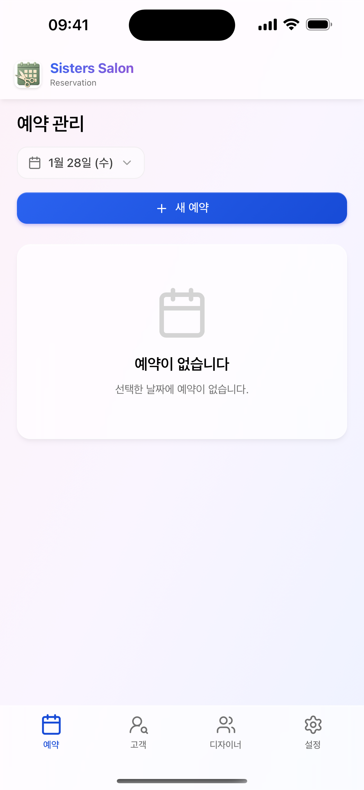
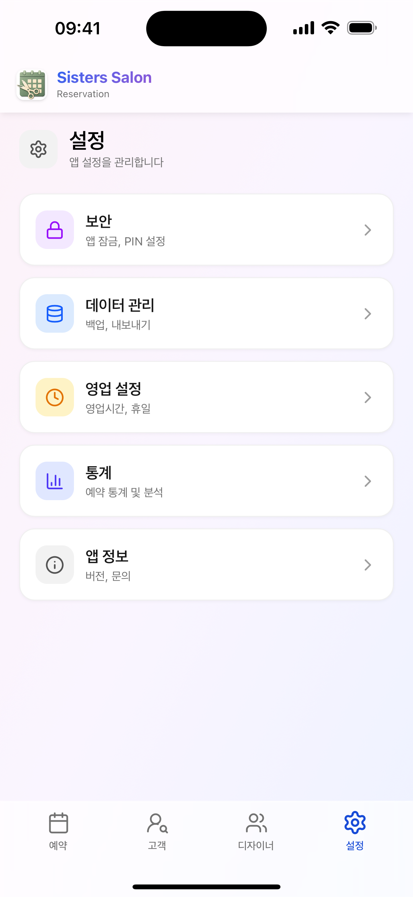
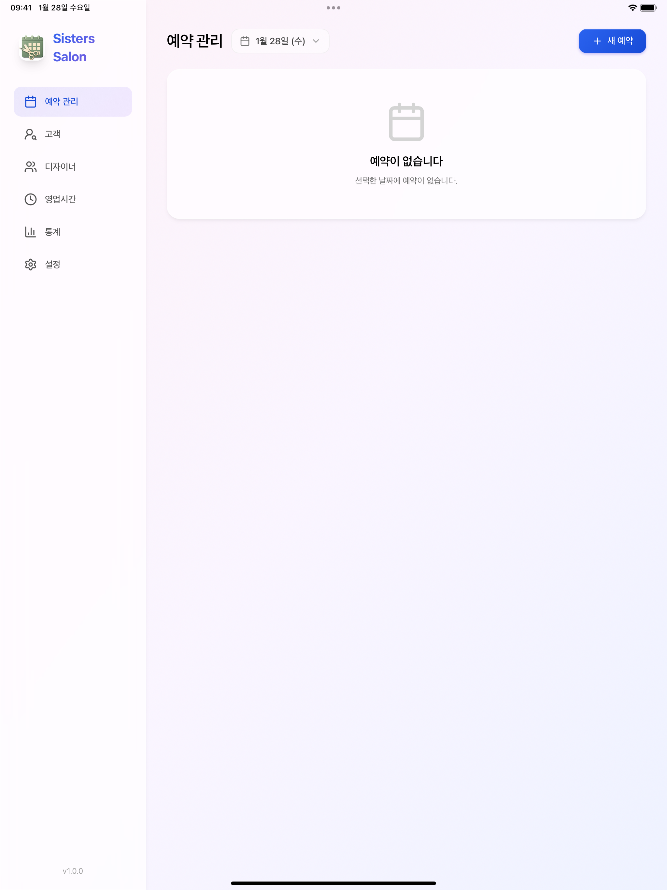
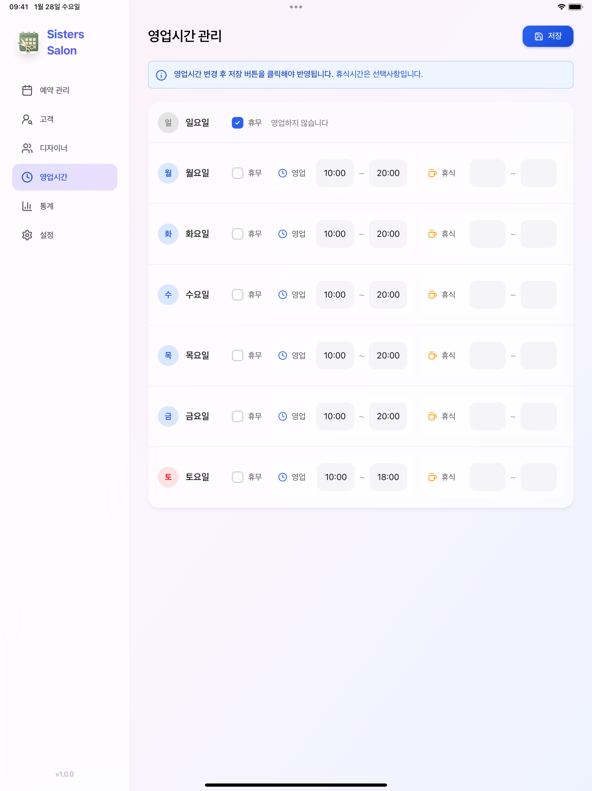

# Sisters Salon Reservation App


> 헤어 살롱 예약 관리를 위한 크로스 플랫폼 로컬 애플리케이션

기존 웹 프로젝트([sisters-salon-reservation](https://github.com/example/sisters-salon-reservation))를 **Tauri 2.0** 기반의 크로스 플랫폼 데스크탑/모바일 앱으로 전환한 프로젝트입니다. 서버 없이 로컬에서 모든 데이터를 관리하며, 개인정보 보호와 오프라인 사용에 최적화되어 있습니다.

---

## 주요 특징

| 특징 | 설명 |
|------|------|
| **로컬 전용** | 서버 불필요, 모든 데이터는 기기에 안전하게 저장 |
| **크로스 플랫폼** | 하나의 코드베이스로 5개 플랫폼 지원 |
| **반응형 UI** | iPhone, iPad, Desktop에 최적화된 적응형 레이아웃 |
| **오프라인 지원** | 인터넷 연결 없이 완벽하게 동작 |
| **개인정보 보호** | PIN/생체인증 앱 잠금 기능 |
| **클라우드 백업** | iCloud, Google Drive 연동 백업 |

---

## 지원 플랫폼

| 플랫폼 | 지원 | 빌드 형식 | 비고 |
|--------|:----:|----------|------|
| **macOS** | ✅ | `.dmg`, `.app` | Intel + Apple Silicon (Universal Binary) |
| **Windows** | ✅ | `.msi`, `.exe` | x64 지원 |
| **Linux** | ✅ | `.deb`, `.AppImage` | x64 지원 |
| **iOS** | ✅ | `.ipa` | iPhone, iPad 지원 (iOS 13+) |
| **Android** | ✅ | `.apk`, `.aab` | Android 7.0+ (API 24) |

---

## 주요 기능

### 예약 관리
- 예약 생성, 조회, 수정, 삭제 (CRUD)
- 5단계 상태 관리: `대기중` → `확정` → `완료` / `취소` / `노쇼`
- 캘린더 기반 예약 현황 시각화
- 고급 검색 및 필터링

### 디자이너 관리
- 디자이너 등록/수정/삭제
- 전문분야, 활성상태 관리
- 디자이너별 예약 현황

### 영업시간 관리
- 요일별 영업시간 설정
- 점심시간(휴게시간) 설정
- 특별 휴일 관리

### 통계 대시보드
- 기간별 예약 통계 및 차트
- 디자이너별 실적 분석
- 서비스별 통계

### 데이터 내보내기
- **Excel 내보내기** - 예약 목록, 월별 통계, 디자이너 실적 시트
- **CSV 내보내기** - 간편한 데이터 추출
- 기간 선택: 이번 달 / 최근 3개월 / 전체

### 클라우드 백업
| 서비스 | 플랫폼 |
|--------|--------|
| **iCloud** | iOS, macOS |
| **Google Drive** | Android |
| **로컬 백업** | 모든 플랫폼 |

- 자동 백업 스케줄링 (매일/매주)
- 백업 목록에서 복원

### 앱 잠금
| 잠금 방식 | iOS | macOS | Windows | Android |
|----------|:---:|:-----:|:-------:|:-------:|
| **PIN (4-6자리)** | ✅ | ✅ | ✅ | ✅ |
| **Face ID** | ✅ | - | - | - |
| **Touch ID** | ✅ | ✅ | - | - |
| **Windows Hello** | - | - | ✅ | - |
| **지문인식** | - | - | - | ✅ |

### iOS 네이티브 UX
- **스와이프 백 제스처** - 화면 왼쪽 가장자리에서 스와이프하여 뒤로가기
- **중첩 네비게이션 지원** - 다단계 설정 화면에서도 올바르게 동작
- **더블 탭 리셋** - 현재 탭을 두 번 탭하면 초기 상태로 리셋
- **미저장 변경사항 경고** - 저장하지 않은 변경사항이 있을 때 이동 시 경고

### 모달 UX
- **버튼 하단 고정** - 취소/저장 버튼이 항상 화면 하단에 표시
- **하단 탭 자동 숨김** - 모달 열림 시 하단 네비게이션 자동 숨김
- **Safe Area 지원** - iOS notch/홈 인디케이터 영역 완벽 대응
- **반응형 레이아웃** - 태블릿에서 2열 그리드 배치

### 고객 관리
- 고객 등록/수정/삭제
- 고객 검색 및 필터링
- 예약 연동 (고객 선택 시 자동 정보 입력)
- 방문 이력 조회

---

## 기술 스택

### Frontend
| 기술 | 버전 | 용도 |
|------|------|------|
| React | 19.x | UI 프레임워크 |
| TypeScript | 5.x | 타입 시스템 |
| Vite | 5.x | 빌드 도구 |
| Tailwind CSS | 4.x | 스타일링 (Glassmorphism) |
| Recharts | 2.x | 차트/데이터 시각화 |
| date-fns | 3.x | 날짜 처리 |

### Backend (Tauri)
| 기술 | 버전 | 용도 |
|------|------|------|
| Tauri | 2.x | 크로스 플랫폼 프레임워크 |
| Rust | 1.75+ | 백엔드 로직 |
| rusqlite | 0.31.x | SQLite 데이터베이스 |
| rust_xlsxwriter | 0.79.x | Excel 파일 생성 |
| keyring | 3.x | OS 보안 저장소 |
| bcrypt | 0.15.x | PIN 해싱 |

---

## 스크린샷

### iPhone

| 예약 관리 | 고객 관리 | 설정 | 통계 |
|:---:|:---:|:---:|:---:|
|  |  |  |  |

### iPad

| 예약 관리 | 설정 |
|:---:|:---:|
|  |  |

---

## 설치 방법

### Desktop

각 플랫폼별 릴리스 파일을 다운로드하여 설치합니다.

| 플랫폼 | 다운로드 |
|--------|---------|
| macOS | `Sisters-Salon-x.x.x-universal.dmg` |
| Windows | `Sisters-Salon-x.x.x-x64-setup.exe` |
| Linux | `sisters-salon_x.x.x_amd64.AppImage` |

> 릴리스 파일은 [Releases](https://github.com/your-repo/releases) 페이지에서 다운로드할 수 있습니다.

### Mobile

| 플랫폼 | 설치 방법 |
|--------|----------|
| iOS | App Store 또는 TestFlight (준비 중) |
| Android | APK 직접 설치 또는 Play Store (준비 중) |

---

## 개발 환경 설정

### 사전 요구사항

| 도구 | 버전 | 확인 명령어 |
|------|------|------------|
| Node.js | 18.x 이상 | `node --version` |
| npm | 9.x 이상 | `npm --version` |
| Rust | 1.75 이상 | `rustc --version` |
| Cargo | 1.75 이상 | `cargo --version` |

### 플랫폼별 추가 요구사항

#### macOS
```bash
# Xcode Command Line Tools
xcode-select --install

# iOS 빌드를 위한 CocoaPods
sudo gem install cocoapods
```

#### Windows
```bash
# Visual Studio Build Tools (C++ 포함)
# https://visualstudio.microsoft.com/visual-cpp-build-tools/
```

#### Android
```bash
# Android Studio 설치 후 환경변수 설정
# ANDROID_HOME, JAVA_HOME
```

### 프로젝트 설정

```bash
# 저장소 클론
git clone https://github.com/your-username/sisters-salon-reservation-app.git
cd sisters-salon-reservation-app

# 의존성 설치
npm install

# 개발 서버 실행 (Desktop)
npm run tauri dev

# iOS 개발 (시뮬레이터)
npm run tauri ios dev

# Android 개발 (에뮬레이터)
npm run tauri android dev
```

### 빌드

```bash
# macOS (Universal Binary)
npm run tauri build -- --target universal-apple-darwin

# Windows
npm run tauri build -- --target x86_64-pc-windows-msvc

# Linux
npm run tauri build -- --target x86_64-unknown-linux-gnu

# iOS
npm run tauri ios build

# Android
npm run tauri android build
```

---

## 프로젝트 구조

```
sisters-salon-reservation-app/
├── src/                          # React Frontend
│   ├── components/               # UI 컴포넌트
│   │   ├── layout/               # 반응형 레이아웃
│   │   ├── navigation/           # 네비게이션 (사이드바, 탭)
│   │   ├── reservation/          # 예약 관련
│   │   ├── designer/             # 디자이너 관련
│   │   ├── statistics/           # 통계 차트
│   │   └── settings/             # 설정 (백업, 잠금)
│   ├── contexts/                 # React Context
│   ├── hooks/                    # 커스텀 훅
│   ├── lib/                      # 유틸리티
│   ├── types/                    # TypeScript 타입
│   ├── App.tsx
│   └── main.tsx
├── src-tauri/                    # Tauri Backend (Rust)
│   ├── src/
│   │   ├── commands/             # Tauri Commands
│   │   ├── db/                   # SQLite 데이터베이스
│   │   └── services/             # 비즈니스 로직
│   ├── gen/                      # Mobile 프로젝트
│   │   ├── android/
│   │   └── apple/
│   ├── Cargo.toml
│   └── tauri.conf.json
├── docs/                         # 문서
│   ├── specs/                    # Phase별 개발 스펙
│   ├── progress/                 # 진행 기록
│   └── references/               # 참고 문서
├── CLAUDE.md                     # AI 어시스턴트 가이드
└── README.md                     # 이 파일
```

---

## 개발 문서

### Phase별 스펙 문서
| Phase | 문서 | 내용 |
|-------|------|------|
| 0 | [Overview](docs/specs/00-overview.md) | 프로젝트 개요, 일정 |
| 1 | [Project Setup](docs/specs/01-project-setup.md) | Tauri 프로젝트 초기화 |
| 2 | [Database](docs/specs/02-database.md) | SQLite 스키마, CRUD |
| 3 | [Core Features](docs/specs/03-core-features.md) | 예약/디자이너/영업시간 |
| 4 | [Responsive UI](docs/specs/04-responsive-ui.md) | 반응형 레이아웃 |
| 5 | [Statistics](docs/specs/05-statistics.md) | 통계 대시보드 |
| 6 | [Export & Backup](docs/specs/06-export-backup.md) | 내보내기, 클라우드 백업 |
| 7 | [App Lock](docs/specs/07-app-lock.md) | PIN/생체인증 |
| 8 | [Build & Deploy](docs/specs/08-build-deploy.md) | 빌드 설정, CI/CD |
| 9 | [Customer Management](docs/specs/09-customer-management.md) | 고객 관리 |
| 10 | [UX & Navigation](docs/specs/10-ux-navigation.md) | 스와이프 제스처, 네비게이션 개선 |
| 11 | [iOS Modal UX](docs/specs/11-ios-modal-ux.md) | 모달 UX 개선, 반응형 레이아웃 |

### 참고 문서
- [API Mapping](docs/references/api-mapping.md) - Express → Tauri 변환 가이드
- [Git Workflow](docs/references/git-workflow.md) - 브랜치 전략, 커밋 규칙
- [Changelog](docs/progress/changelog.md) - 개발 진행 기록

---

## 개발 로드맵

| Phase | 내용 | 상태 | 완료일 |
|:-----:|------|:----:|:------:|
| 1 | 프로젝트 초기화 (Tauri + React + TypeScript) | ✅ | 2026-01-21 |
| 2 | 데이터베이스 (SQLite 스키마, CRUD) | ✅ | 2026-01-21 |
| 3 | 핵심 기능 (예약, 디자이너, 영업시간) | ✅ | 2026-01-21 |
| 4 | 반응형 UI (Mobile, Tablet, Desktop) | ✅ | 2026-01-22 |
| 5 | 통계 대시보드 (Recharts) | ✅ | 2026-01-23 |
| 6 | 내보내기 & 백업 (Excel, iCloud CloudKit) | ✅ | 2026-01-26 |
| 7 | 앱 잠금 (PIN 인증) | ✅ | 2026-01-25 |
| 8 | 빌드 & 배포 (CI/CD, 앱 스토어) | 🔄 | - |
| 9 | 고객 관리 | ✅ | 2026-01-24 |
| 10 | UX 개선 (스와이프 제스처, 네비게이션) | ✅ | 2026-01-26 |
| 11 | iOS 모달 UX (버튼 고정, 반응형 개선) | ✅ | 2026-01-27 |

**범례**: ⬜ 대기중 · 🔄 진행중 · ✅ 완료

### 테스트 완료 플랫폼
- ✅ macOS (Desktop)
- ✅ iOS Simulator (iPhone/iPad)
- ✅ iOS Device (iPhone 16 Pro)
- ✅ Android Emulator

---

## 기여 방법

이 프로젝트에 기여해주셔서 감사합니다!

### Git 브랜치 전략

```
main                    # 프로덕션 릴리스
└── develop             # 개발 통합 브랜치
    └── task/*          # 기능 개발 브랜치
```

### 기여 절차

1. `develop` 브랜치에서 새 브랜치 생성
2. 작업 수행 및 커밋
3. Pull Request 생성
4. 코드 리뷰 후 머지

### 커밋 메시지 규칙

```
<type>(<scope>): <subject>

feat: 새 기능
fix: 버그 수정
docs: 문서 수정
refactor: 리팩토링
chore: 기타 (빌드, 설정)
```

자세한 내용은 [Git Workflow 문서](docs/references/git-workflow.md)를 참고하세요.

---

## 라이선스

이 프로젝트는 [MIT License](LICENSE) 하에 배포됩니다.

```
MIT License

Copyright (c) 2026 Sisters Salon

Permission is hereby granted, free of charge, to any person obtaining a copy
of this software and associated documentation files (the "Software"), to deal
in the Software without restriction, including without limitation the rights
to use, copy, modify, merge, publish, distribute, sublicense, and/or sell
copies of the Software, and to permit persons to whom the Software is
furnished to do so, subject to the following conditions:

The above copyright notice and this permission notice shall be included in all
copies or substantial portions of the Software.

THE SOFTWARE IS PROVIDED "AS IS", WITHOUT WARRANTY OF ANY KIND, EXPRESS OR
IMPLIED, INCLUDING BUT NOT LIMITED TO THE WARRANTIES OF MERCHANTABILITY,
FITNESS FOR A PARTICULAR PURPOSE AND NONINFRINGEMENT. IN NO EVENT SHALL THE
AUTHORS OR COPYRIGHT HOLDERS BE LIABLE FOR ANY CLAIM, DAMAGES OR OTHER
LIABILITY, WHETHER IN AN ACTION OF CONTRACT, TORT OR OTHERWISE, ARISING FROM,
OUT OF OR IN CONNECTION WITH THE SOFTWARE OR THE USE OR OTHER DEALINGS IN THE
SOFTWARE.
```

---

## 연락처

- **Issues**: [GitHub Issues](https://github.com/devbada/sisters-salon-reservation-app/issues)
- **Email**: imdevbada@gmail.com

---

<p align="center">
  Made with ❤️ using <a href="https://tauri.app">Tauri</a> + <a href="https://react.dev">React</a>
</p>
